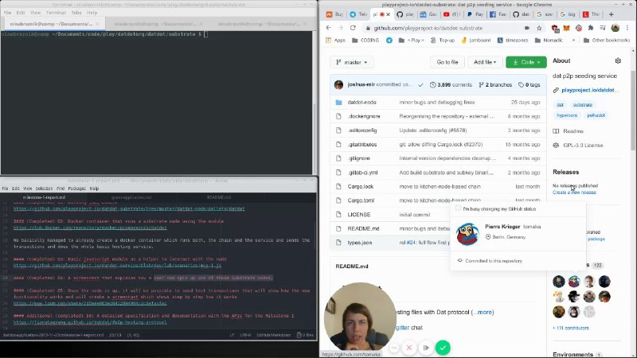
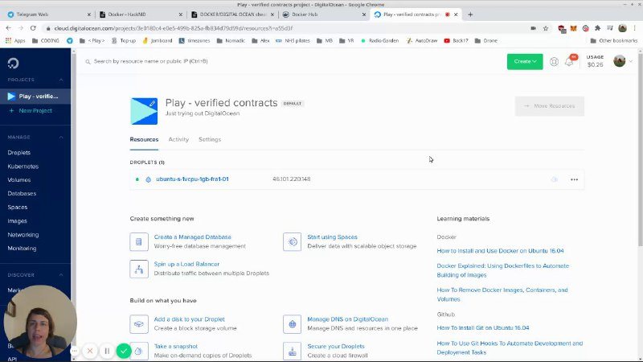

# News

---

## 2020.07.20 `release` Milestone 1
Good news. We just finished our phase 1 which means our datdot chain is running and communicating with dat/hyper* and does the test hosting of the hypercores. 
We are very excited about it.

**What's next?**
* [ ] making all this more robust, 
* [ ] improve the economics of the whole service,
* [ ] add the UI,
* [ ] refine proof of service, which repeats over and over for as long as the hosting contract lasts
  * which consists of proof of storage
  * and proof of retrievability
* [ ] more fun stuff 
* [ ] and after this we can finally gets some tests running

**more details**

---

